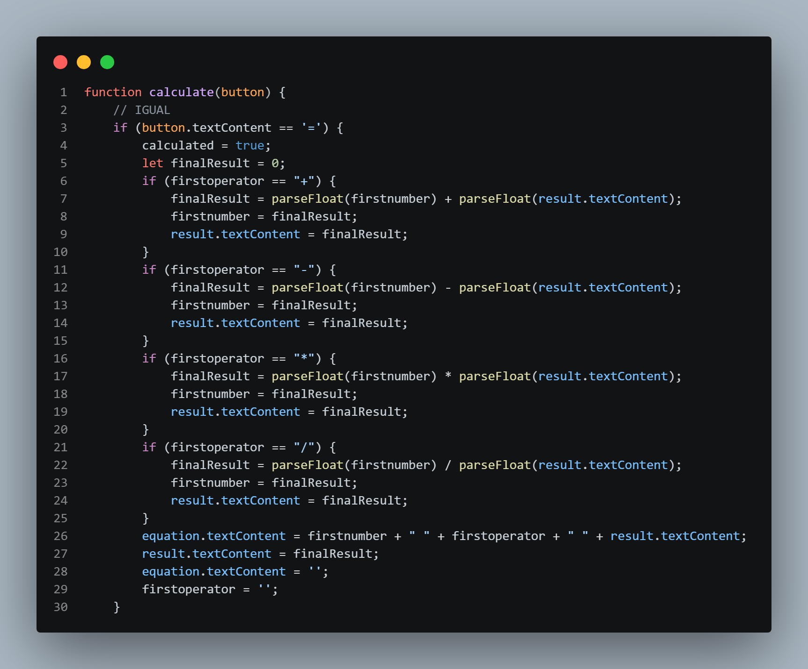

# 🧮 Modern Calculator

Uma calculadora moderna desenvolvida com HTML, CSS e JavaScript para praticar lógica de programação e manipulação do DOM.

## 🚀 Funcionalidades

* Operações matemáticas básicas
* Soma
* Subtração
* Multiplicação
* Divisão
* Limpar display
* Atualização dinâmica do visor
* Interface moderna
* Responsividade

## 🛠️ Tecnologias utilizadas

* HTML5
* CSS3
* JavaScript

## 📚 O que pratiquei nesse projeto

* Manipulação do DOM
* Eventos com `addEventListener`
* Condições com `if`
* Funções
* Variáveis de estado
* Operadores matemáticos
* `parseFloat()`
* Atualização dinâmica do display
* Organização de lógica em JavaScript

## 🎯 Objetivo

Esse projeto foi desenvolvido para praticar lógica de programação através da criação de uma calculadora funcional utilizando JavaScript puro.

## 📸 Preview

## 🔗 Deploy

(Adicionar link do Vercel futuramente)
